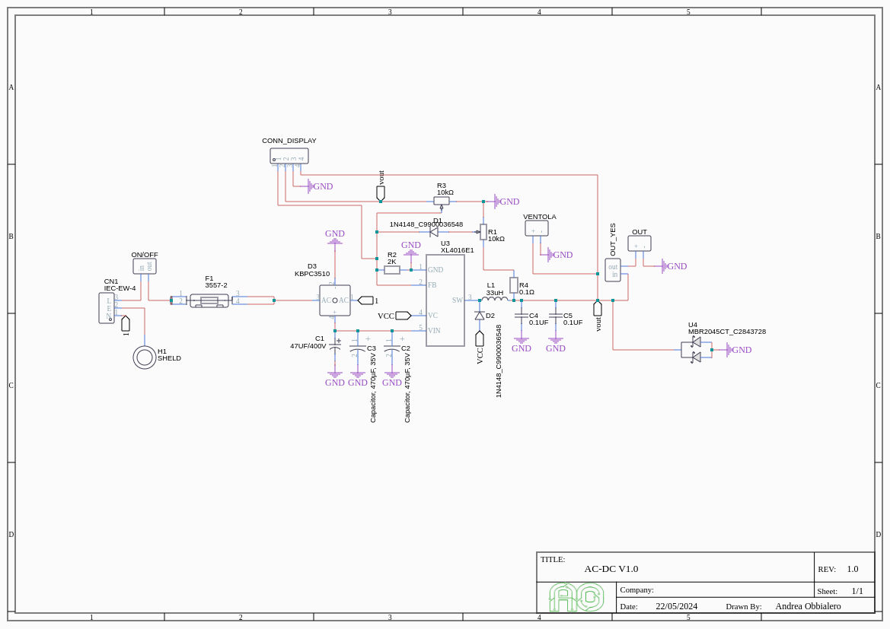

# ⚡ Adjustable Bench Power Supply (0–20V / 5A) with XL4016

  

A fully custom-designed adjustable bench power supply capable of delivering a variable output from **1.25V to 20V** with a continuous current of up to **5A**. The project uses an **AC-DC converter** followed by a **DC-DC step-down (buck)** regulator based on the **XL4016**.

The entire circuit is implemented on a single PCB designed in **EasyEDA**, with no pre-assembled modules.

---

## 📌 Technical Specifications

| Feature                        | Value                                 |
|-------------------------------|---------------------------------------|
| **Input**                     | 220V AC                               |
| **Internal DC Voltage**       | Up to 32V DC                          |
| **Adjustable Output**         | 1.25V – 20V                           |
| **Max Current**               | 5A continuous                         |
| **Typical Efficiency**        | >80%                                  |
| **Conversion Type**           | AC-DC + DC-DC Step-Down (Buck)        |
| **PCB**                       | Designed using EasyEDA                |

---

## 📦 Bill of Materials (BOM)

Refer to the [full Bill of Materials (BOM.csv)](./hardware/BOM.csv) for a detailed list of all components used, including codes, values, and technical notes.

---

## 📊 Block Diagram

---

## 🔢 Output Voltage Calculation

The output voltage is controlled via a voltage divider made up of **R1**, **P1**, and **R2**, according to the formula:

Vout = 1.25V × (1 + (R1 + P1) / R2)

yaml
Copia
Modifica

### Typical Values:

- **R1** = 10kΩ  
- **R2** = 2kΩ  
- **P1** = 10kΩ (adjustable trimmer)  
- **Achievable range**: ~ **1.25V – 20V**

---

## 🛠️ PCB Design Recommendations

- **AC traces**: separated from DC, width ≥ 2mm, insulation > 3mm  
- **High-current DC traces**: width ≥ 2.5mm to ensure continuous 5A  
- **Extended ground plane**, preferably on both PCB layers  
- **Thermal vias** below heat sinks and converters for improved dissipation  
- **C1 and C3 capacitors**: placed as close as possible to the VIN pin  
- **AC area**: clearly marked with ⚡ symbols and physically isolated  
- **Fan and heat sinks**: highly recommended for currents > 3A

---

## 🔍 Monitoring (Optional)

| Component         | Description                            |
|------------------|----------------------------------------|
| **M1**           | Digital volt-ammeter                   |
| **R3**           | 0.1Ω / 5W shunt resistor               |
| **Connectors**   | Isolated banana jacks for output       |

---

## 🧱 Safety and Mechanics

- **Fireproof and ventilated enclosure** (ABS V0 or aluminum with heatsinks)  
- **AC side protection**: fuse, isolated tracks, covered terminals  
- **AC wiring**: use only silicone-insulated cables  
- **Forced ventilation**: mandatory for currents > 3A  
- **AC areas**: marked with ⚡ symbols and safe distances

---

## 📂 Included Files

- `README.md` – Project documentation  
- `schema_blocchi.pdf` – Block diagram  
- `alimentatore_xl4016.brd / .sch` – EasyEDA files (PCB and schematic)  
- `distinta_base.xlsx` – Detailed BOM  
- `BOM.csv` – Simplified component list

---

## 🖼️ Images and PCB Views

### 🔧 Electrical Schematic

### 📐 PCB - 2D Layout

### 🖥️ Assembled 3D PCB View

---

## 🔍 External Components

| Component                      | Link                                                  | Quantity |
|-------------------------------|-------------------------------------------------------|----------|
| **Digital Volt-Ammeter**      | [Amazon](https://www.amazon.it/dp/B01MUC149K)         | 1        |
| **Rocker Switch**             | [TEMU](https://www.temu.com/g-601099550024059.html)   | 2        |

---

## ⚠️ Warnings

> ⚡ **WARNING: This project operates at mains voltage (220V AC).**  
> Extreme caution is required during assembly and use.  
> Intended for experienced users only.  
> Always insulate AC sections and use a safe, ventilated enclosure.

---

## 📬 Contact

For questions or suggestions:  
**Andrea Obbialero** – [https://obbialero.github.io/](https://obbialero.github.io/)

---

## 📘 License

This project is released under the **MIT License**.  
It is free for personal, educational, and commercial use, provided proper attribution is given.

---
